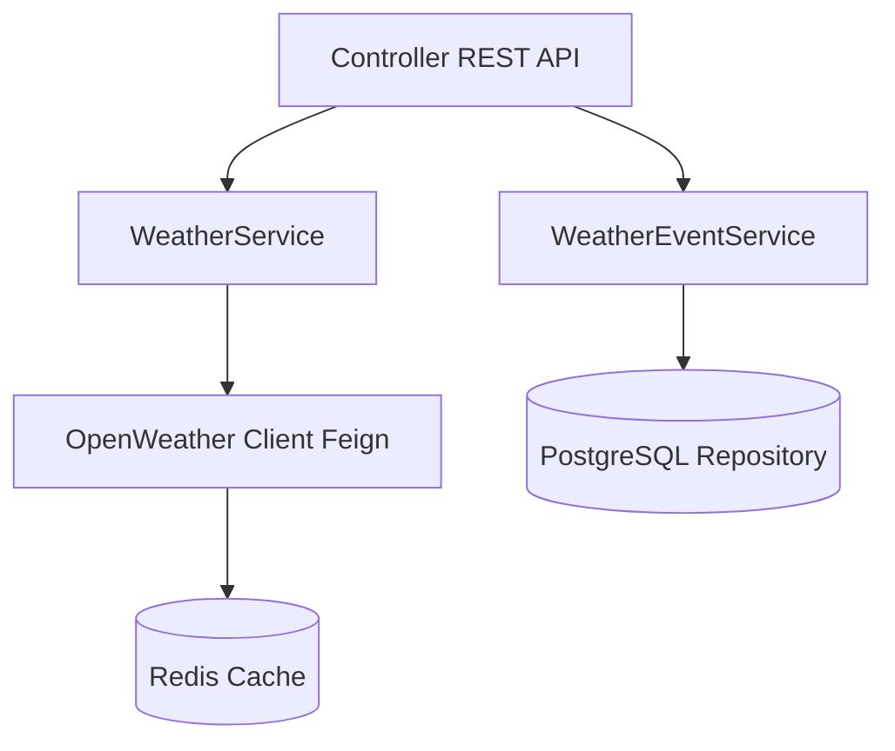

# 🌦️ Weather API Demo

Учебный проект на **Spring Boot**, демонстрирующий работу с внешним API (**OpenWeather**), кэширование с помощью **Redis**, хранение истории запросов в **PostgreSQL** и документирование API через **Swagger**.

---

## 📌 Функциональность

- Получение текущей погоды по городу (через OpenWeather API).
- Сохранение истории запросов в PostgreSQL.
- Кэширование ответов в Redis (уменьшает количество запросов к OpenWeather).
- Просмотр истории запросов (всех или по конкретному городу).
- Документирование и тестирование API через Swagger UI.

---

## 🛠️ Технологии

- **Java 17+**
- **Spring Boot 3**
- **Spring Data JPA (PostgreSQL)**
- **Spring Cache (Redis)**
- **Spring Cloud OpenFeign** (для интеграции с OpenWeather API)
- **Swagger**
- **Gradle**

---

## ⚙️ Архитектура


---

## 🚀 Запуск проекта

### 1. Клонирование репозитория
```bash
git clone https://github.com/Muratali15/weather-api-demo.git
cd weather-api-demo
```
### 2. Настройка application.yml
Укажи свои параметры:

```yaml
spring:
  datasource:
    url: jdbc:postgresql://localhost:5432/weather_db
    username: postgres
    password: postgres
  jpa:
    hibernate:
      ddl-auto: update
    show-sql: true

  cache:
    type: redis

redis:
  host: localhost
  port: 6379

openweather:
  api:
    key: <YOUR_API_KEY>
```

### 3. Запуск
```bash
   ./gradlew bootRun
```

---

## 📚 Swagger (OpenAPI)
После запуска:  
👉 http://localhost:8080/swagger-ui.html

🔑 Примеры запросов  
- Получить погоду по городу:
```http
GET /api/weather

Пример:

curl http://localhost:8080/api/weather?city=Almaty
```

- Получить историю запросов
```http
GET /api/weather/requests
```
- Получить историю запросов по городу
```http
GET /api/weather/requests?city=London
```

---


## 🗄️ Работа с Redis
Очистить кэш:

```bash
   docker exec -it redis redis-cli FLUSHALL
   ```
Проверить ключи:

```bash
   docker exec -it redis  redis-cli KEYS *
```
